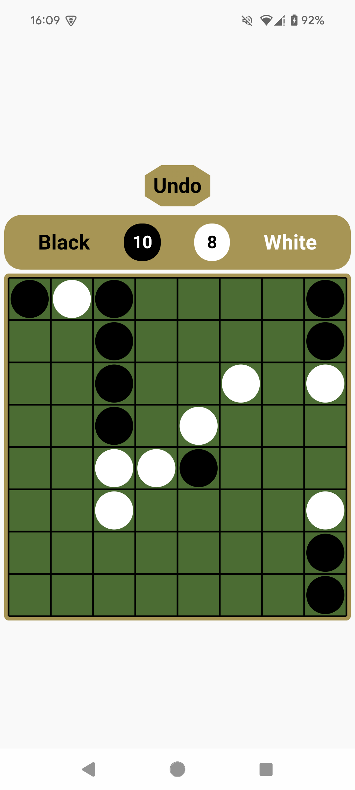

# Aspect Ratios Tested

| Galaxy Tab S6 | Pixel 4A | Pixel 8A |
|---------|---------|---------|
| 2560x1600 (16:10) | 2340x1080 (13:6) | 2400x1080 (20:9) |

# Landscape

| Galaxy Tab S6 | Pixel 4A | Pixel 8A |
|---------|---------|---------|
|  |  |  |

# Portrait

| Galaxy Tab S6 | Pixel 4A | Pixel 8A |
|---------|---------|---------|
|  |  |  |

# Video

